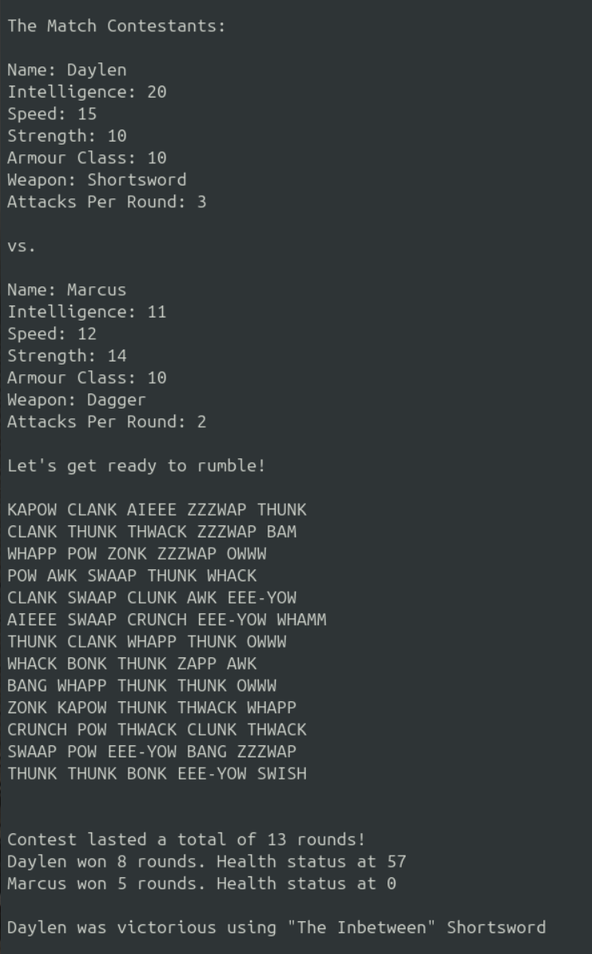

## Daylen Game

A quick command-line app to learn coding and the development process.

### Game Description:

Running the main.py script initializes the required variables and creates a list of game entrants from local resource files. Each entrant is randomly assigned a weapon. Matches are formed by pairing two randomly selected entrants. 

In each round, an entrant may attack their opponent a number of times based on their ability scores. If an attack roll exceeds the opponent’s armor class, it deals damage according to the weapon’s dynamic value. Additionally, five onomatopoeic words will appear at random to represent the action in the round. 

A match ends when one contestant’s health drops to zero or below.

### File Overview:

- `main.py` — Entry point of the application; handles game flow and console output.
- `game_resources.py` — Classes and setup functions for game resources e.g., entrants and weapons
- `game_utilities.py` — Utility functions for logging game outcome data and loading sounds
- `resource_entrants.json` — Add a new or edit existing entrant information
- `resource_weapons.json` — Add a new or edit existing weapon information
- `utility_conflict_sounds.txt` — Listing of onomatopoeia related words used during matches
- `log_game_results.csv` — Game log file displaying match outcome data
- `log_round_results.csv` — Log file of each match round data

### Instructions:

1. Download this repo to your local system
2. In a terminal window, navigate to the local folder for the repo
3. Run the script using the Python3 interpreter
    ```bash
    python3 main.py
    ```
4. Enjoy the game 


   


### General Python Resources:

[Python Interpreter Downloads](https://www.python.org/downloads/)

[Python.org Python Tutorial](https://docs.python.org/3/tutorial/index.html)

[W3Schools Python Tutorial](https://www.w3schools.com/python/)


